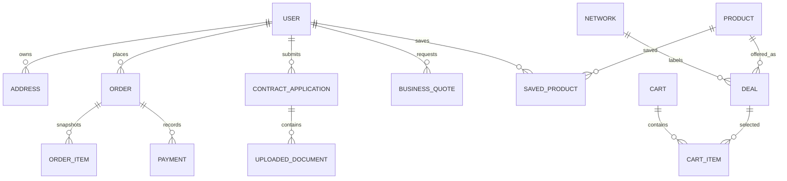

# Sir Device architecture

## Chosen stack

Sir Device uses Python, FastAPI, SQLAlchemy, Alembic, Jinja, vanilla JavaScript and responsive CSS. PostgreSQL is the production database; SQLite is limited to local development and automated tests.

## Layer boundaries

```text
Presentation -> Application -> Domain
       |              |
       v              v
Infrastructure implements domain ports
```

- **Domain** owns enums, policies and integration contracts. It does not import FastAPI or SQLAlchemy models.
- **Application** coordinates use cases such as catalogue import, checkout, applications, quotes and notifications.
- **Infrastructure** implements persistence, payments, storage and email.
- **Presentation** translates HTTP requests into application calls and renders responses.

This dependency direction keeps business behaviour independent from delivery and infrastructure details.

## SOLID application

- **Single responsibility:** routers handle HTTP, services orchestrate use cases, repositories query persistence, and adapters communicate with external systems.
- **Open/closed:** new payment or storage providers can implement existing ports without changing checkout or document services.
- **Liskov substitution:** local and S3 storage implementations satisfy the same `FileStorage` contract; payment gateways satisfy `PaymentGateway`.
- **Interface segregation:** ports are small and focused rather than one broad infrastructure interface.
- **Dependency inversion:** application services depend on domain abstractions and repositories, not vendor SDKs.

## No magic business strings

Statuses, product categories, roles, deal types, notification templates, audit actions, payment providers and storage providers are centralised in `app/domain/enums.py`. Route prefixes, reference prefixes and role groups are centralised in `app/core/constants.py`. Environment-dependent values are loaded through the immutable `Settings` object.

Human-facing labels are centralised in `app/presentation/content.py` so stored enum values are not duplicated throughout templates.

## Data model



No catalogue, customer, order or dashboard records are seeded. The first administrator is created explicitly with an operational command.

## Transaction and data-integrity rules

- Currency is stored in integer cents.
- Orders contain immutable deal and product snapshots.
- Stable deal `source_key` values make imports idempotent.
- CSV/XLSX imports validate all rows before committing any changes.
- Unique constraints protect identity, product, network and saved-item keys.
- Status values are constrained by application enums.
- Material admin actions produce audit records.
- Expired promotions are unpublished by service policy.

## Security boundaries

- Passwords use salted scrypt hashes.
- Sessions use signed, expiring HTTP-only cookies.
- State-changing browser forms require CSRF validation.
- Administration routes enforce role groups.
- Uploaded files use generated storage keys and protected retrieval.
- The S3 adapter keeps objects private and uses server-side encryption.
- Payment notifications are signature- and amount-checked.
- Production startup fails when core security and database settings are unsafe.

## Integration seams

The application is ready for later implementations of:

- Vodacom and MTN catalogue feeds
- network application submission
- credit checks and upgrade eligibility
- live coverage and stock
- SMS delivery
- alternate payment gateways
- malware scanning and document lifecycle automation

These integrations should be added behind ports or dedicated application services rather than directly inside routers.
